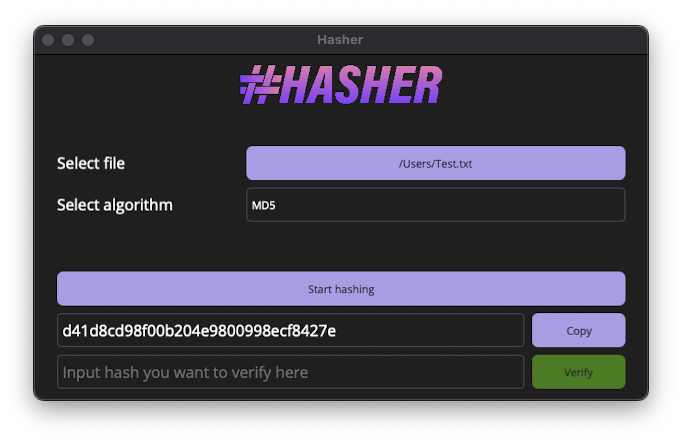
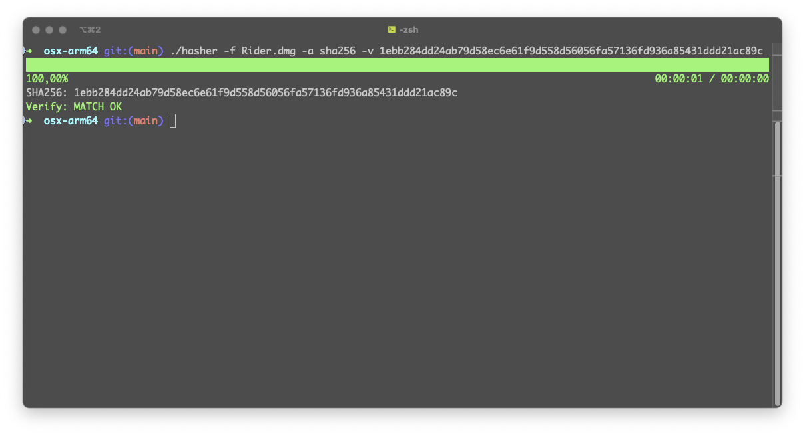

# Hasher

[](https://github.com/larsjuvik/hasher/actions/workflows/CI.yml)


A cross-platform, simple-to-use application for computing and verifying file-hashes.
Comes as a GUI- or CLI-application. Built on .NET 8.


<p align="center">
  
</p>
<p align="center" >
  
</p>


## Build and run project

In order to build this project, you need to install MAUI.

```shell
dotnet workload install maui
```

### macOS

```bash
dotnet publish -c Release -f net8.0-maccatalyst Hasher/Hasher.csproj
```

## Supported algorithms

- MD5
- SHA1
- SHA256
- SHA384
- SHA512

## Remaining work

1. More testing of the application itself, and more test-cases in unit tests
2. ~~Add an app logo, s.t. it shows a different logo than the purple ".NET" in the dock.~~
3. ~~CI pipeline~~
4. Testing on Windows
5. Build instructions for Windows
6. ~~Add console application for hasher~~

## Thanks :heart:

Thanks to the following libraries and frameworks for helping build hasher:
* [.NET MAUI](https://github.com/dotnet/maui)
* [ShellProgressBar](https://github.com/Mpdreamz/shellprogressbar)
