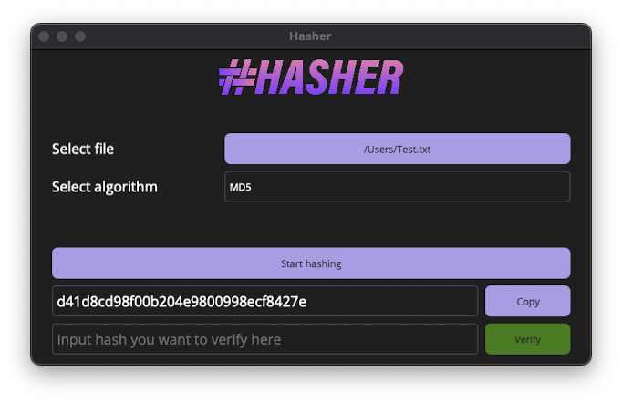

# Hasher

[](https://github.com/larsjuvik/hasher/actions/workflows/CI.yml)
[](https://github.com/larsjuvik/hasher/actions/workflows/CD-Console.yml)


**This project is still in alpha - expect the software to have errors.**

A cross-platform, simple-to-use application for verifying hashes of files, free for everyone. Made with .NET MAUI.

<p align="center">
  
</p>

## Build and run project

For macOS:

```bash
cd Hasher
dotnet build -t:Run -f net8.0-maccatalyst
```

## Supported algorithms

- MD5
- SHA1
- SHA256
- SHA384
- SHA512

## Remaining work

This application is not done yet, and there is several things that needs implementation.

1. More test-cases of the hashing computations, and more testing of the application itself.
2. Make the "Copy" and "Verify" buttons nicer. Right now their color scheme is a bit confusing.
3. ~~Add an app logo, s.t. it shows a different logo than the purple ".NET" in the dock.~~
4. CI/CD pipeline.
5. Testing on Windows. Has only been tested on macOS so far.
6. Add build instructions for Windows
7. Add console application for hasher
